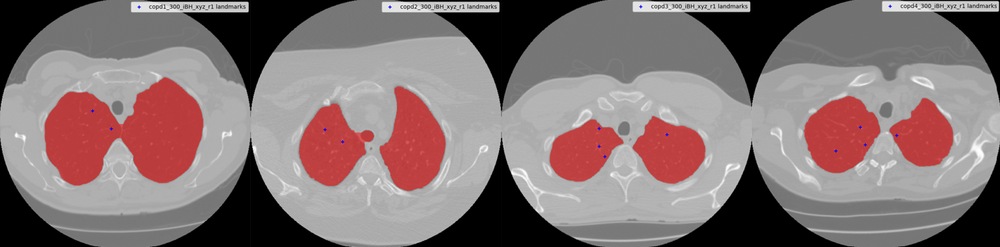

# <h1 align="center">COPDgene CT Registration</h1>

<h3 align="center">A full lung segmentation, pre-processing and image registration methodologies that were applied on 4DCT DIR-Lab dataset challenge.</h3>





Table of Contents
=================

<!--ts-->
   * [Dataset Structure](#dataset-structure)
   * [Dataset Exploration](#dataset-exploration)
   * [Setup Guideline](#setup-guideline)
<!--te-->


Dataset Structure
============
```
.
├── .
├── dataset
├── description.json                     # A JSON file that holds the dataset description.
├── train                                # Training data directory. Given all sort of data.
    └── copd1
        ├── copd1_300_eBH_xyz_r1.txt     # exhale keypoints
        ├── copd1_300_iBH_xyz_r1.txt     # inhale keypoints
        ├── copd1_eBHCT.img              # raw exhale intensity volume
        └── copd1_iBHCT.img              # raw inhale intensity volume
    ├── copd2
    ├── copd3
    └── copd4 
└── test                                 # Test data directory. Given only the intensity volumes and inhale keypoints.
    ├── copdXX
    ├── copdXX
    ├── copdXX
    └── copdXX
```

Dataset Exploration
============
To visually explore the raw data given in the challenge, please use the MatlabUtilityPack1_v1 MATLAB files to read and import both raw and keypoint data on MATLAB. Instructions are found in MatlabUtilityPack1.pdf file inside the directory.

Setup Guideline
============
As the main objective is to register and transform the labels, it is crutial to follow the steps in order to replicate the best results obtained using our implementation. 

Firstly, after having the dataset in the correct folder structure, we prepare the inhale keypoint file to match transformix requirements using the following command line. Note that `<<DATASET_SPLIT_PATH>> = dataset/train` when you wish to run it on the training data to obtain the same evaluation results. You can set it to the test split, however, you won't be able to evaluate the test if the exhale (groundtruth) keypoints are not given in a later step.
```
python prepare_keypoints_transformix.py --dataset_path "<<DATASET_SPLIT_PATH>>" --keypoint_type "inhale"
```

Then, to work on the data, we need to parse the raw files to nifti format using the following command line. This will create the nifti volumes in the same data folder.
```
python parse_raw.py --dataset_path "<<DATASET_SPLIT_PATH>>"
```

Next is to segment the lung, where it will produce the best segmentation directly from all segmentation masks iterations that were experimented.
```
python segment.py --dataset_path "<<DATASET_SPLIT_PATH>>"
```

After that, we pre-process the data using the normalization implementation (as it got the best results).
```
python preprocess.py --dataset_path "<<DATASET_SPLIT_PATH>>" --experiment_name "Normalization"
```

This will create a new folder in your directory called `dataset_processed/Normalization/train/*`, where you will find the same structure as before. It is important to move manually the segmentations and the keypoints txt files to this directory as they are in the `<<DATASET_SPLIT_PATH>>` path, as well as the `description.json` file. Otherwise, the next steps won't work on the processed dataset! We will call `dataset_processed/Normalization/train` as `<<PROCESSED_DATASET_SPLIT_PATH>>`


To create a single experiment, you can run `create_script.py` as below to create the output folder for your experiment as well as the windows .bat file to be called. The output folder will be in the project directory and you can create it as below.
```
python create_script.py --dataset_path "<<PROCESSED_DATASET_SPLIT_PATH>>" --experiment_name "Normalization+UseMasks3+SingleParamFile" --parameters_path "elastix-parameters/Par0003/Par0003.bs-R6-ug.txt" --use_masks
```

Note that you can pass a directory `elastix-parameters/Par0003` instead of a single text file, and elastix will register using all of the files as in order with multiple `-p` flags. 

Inside the output folder of the experiment, you will find the command to call the created bat file.
```
call output\Normalization+UseMasks3+SingleParamFile\Par0003.bs-R6-ug\elastix_transformix.bat 
```

To evaluate and create transformation points submission file
Use `--generate_report` when gt (exhale) points exist. This will create the transformation points file and log the results
```
python evaluate_transformation.py --experiment_name "Normalization+UseMasks3+SingleParamFile" --reg_params_key "Par0003.bs-R6-ug" --dataset_path "<<PROCESSED_DATASET_SPLIT_PATH>>"  --generate_report 
```

If the gt (exhale) points are not given, use the same command without `--generate_report` 
```
python evaluate_transformation.py --experiment_name "Normalization+UseMasks3+SingleParamFile" --reg_params_key "Par0003.bs-R6-ug" --dataset_path "<<PROCESSED_DATASET_SPLIT_PATH>>"
```

